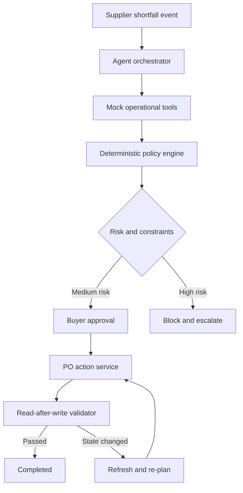

# ProcureAI - Supplier Shortfall Recovery Agent

ProcureAI is a full-stack purchasing agent for **Scenario 2** of the AI Buyer Agent assignment. It receives a supplier shortfall, gathers operational context through mock tools, calculates a recovery plan, applies guardrails, requests buyer approval, executes purchasing actions, and validates the result.

The core demo intentionally goes deep on one scenario. It includes a failure path where supplier capacity changes between planning and execution, forcing the agent to refresh evidence, re-plan, retry, and validate the new outcome.

## Why this design

The system separates probabilistic reasoning from business-critical calculations:

- The **agent/orchestrator** decides which information is needed and presents the decision.
- The **policy engine** owns quantity, budget, storage, MOQ, lead-time, and supplier-capacity checks.
- The **LLM adapter** is optional and can improve the buyer-facing explanation, but it cannot alter the approved plan.
- The **action layer** simulates PO modification and creation.
- The **validator** performs read-after-write checks and rejects incomplete or unsafe outcomes.

This makes the demo understandable, reproducible, and safe to modify in a follow-up discussion.

## Architecture



### Application layers

| Layer | Responsibility |
| --- | --- |
| React dashboard | Incident review, trace, approval, execution log, evaluation |
| Next.js API routes | Full-stack boundary for investigate and execute operations |
| Mock tool/data layer | Inventory, forecast, open POs, suppliers, budget, storage |
| Policy engine | Shortage math, supplier ranking, MOQ rounding, guardrails |
| Optional Groq adapter | Buyer-facing explanation only; deterministic fallback on error |
| Validator | PO existence, duplicates, confirmation, coverage, budget, storage |

## Working scenarios

1. **Standard recovery**
   - Supplier confirms only 250 of 500 units.
   - The agent calculates a 270-unit safety-stock gap.
   - It selects a reliable 2-day supplier and rounds the order to its 100-unit MOQ.
   - A buyer approves 300 units.
   - The PO is created and validated.

2. **Capacity changes mid-run**
   - Investigation sees 300 units available.
   - At execution time, the supplier can provide only 120.
   - The stale write fails safely.
   - The agent refreshes capacity, splits the recovery across two suppliers, retries, and validates both POs.

3. **Budget constraint**
   - The replenishment need is valid, but the required spend exceeds the available budget.
   - The agent blocks execution and escalates instead of blindly creating a PO.

## Agent tools

The trace shown in the UI represents these tool calls:

```text
inventory.get_position
forecast.get_demand
purchase_orders.get_open
suppliers.rank_options
constraints.check_budget
constraints.check_storage
purchase_orders.modify
purchase_orders.create
purchase_orders.validate
```

The mock data is in `lib/procurement/fixtures.ts`, so every decision can be reproduced and discussed without external services.

## Code structure

```text
app/api/agent/            HTTP endpoints for investigation and execution
components/procurement/   Focused dashboard sections
hooks/                    UI state and WebMCP integration
lib/procurement/fixtures  Reproducible mock purchasing scenarios
lib/procurement/planner   Quantity and supplier-selection calculations
lib/procurement/investigate  Evidence gathering and guardrails
lib/procurement/execute   Actions, recovery, and validation
scripts/evaluate.mjs      Deterministic regression suite
```

## Decision policy

The initial shortage is calculated as:

```text
required = forecast demand + safety stock
           - on-hand inventory
           - confirmed incoming inventory
```

Alternate suppliers must satisfy lead-time, capacity, and MOQ rules. Eligible options are ranked by reliability and then price. The order is rounded to the selected supplier's MOQ increment. Budget and storage are checked before any write.

Human approval is required for the medium-risk recovery plan. A failed guardrail produces a blocked escalation. The execution API rejects a plan unless `approved: true` is supplied.

## Feedback loop and validation

Validation is a separate stage after execution. It checks:

- the expected PO records exist;
- PO quantity and supplier match the approved or re-planned action;
- no duplicate PO was created;
- projected closing stock is at or above safety stock;
- budget and storage constraints still pass; and
- supplier confirmation was received.

The capacity-drift fixture proves that a successful plan is not treated as a successful outcome. When the write receives changed supplier capacity, the agent refreshes the evidence, re-plans the remaining need, retries with two suppliers, and validates again.

## API

### Investigate

```http
GET /api/agent/investigate?scenario=standard-recovery
```

Supported scenario keys:

- `standard-recovery`
- `capacity-drift`
- `budget-block`

### Execute

```http
POST /api/agent/execute
Content-Type: application/json

{
  "scenario": "standard-recovery",
  "approved": true
}
```

## Local setup

Requirements: Node.js 22+ and pnpm 11+.

```bash
pnpm install
cp .env.example .env.local
pnpm dev
```

Open the URL shown in the terminal. The application works without an API key.

Run the deterministic regression fixtures with:

```bash
pnpm test:evaluation
```

To enable LLM-generated explanations, set both variables in `.env.local`:

```bash
GROQ_API_KEY=your_key
GROQ_MODEL=your_current_supported_model
```

If the LLM is unavailable, times out, or returns an error, the API uses the deterministic explanation. LLM output never changes purchase quantities or bypasses guardrails.

## Evaluation approach

Each test scenario has an expected decision and safety outcome:

| Scenario | Expected decision | Expected action | Expected validation |
| --- | --- | --- | --- |
| Standard recovery | Source 300 units from the ranked alternate | Modify original PO, create one replacement PO | Closing stock >= safety stock; budget/storage pass |
| Capacity drift | Detect stale capacity and re-plan | Create two replacement POs after first write fails | Both records exist; total coverage and constraints pass |
| Budget constraint | Escalate | No PO created | Policy block recorded; no unintended write |

Evaluation focuses on five questions from the brief:

1. Was the decision correct for the fixture?
2. Did the agent obtain the necessary information?
3. Were all relevant constraints respected?
4. Was the correct action taken or blocked?
5. Was the final operational state validated?

The **Evaluation** tab summarizes all fixtures, while the scenario selector allows each path to be demonstrated interactively.

## Security and reliability notes

- Secrets are read only on the server and are never returned to the browser.
- The action endpoint requires explicit approval.
- Business-critical arithmetic is deterministic.
- LLM output is treated as explanation, not authorization.
- External-model failures degrade to a safe deterministic result.
- The demo uses mock data and mock PO services; production adapters would add authentication, idempotency keys, audit storage, and database transactions.

## Repository checklist

- [x] Full-stack source code
- [x] Setup and run instructions
- [x] Architecture diagram
- [x] Approach and tool design
- [x] Test scenarios and evaluation strategy
- [x] Mock APIs and datasets
- [x] Feedback-loop validation explanation
- [x] Working interactive demo
- [x] `.env.example`
- [x] No secrets committed
